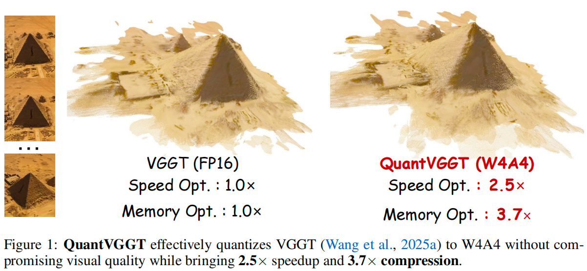
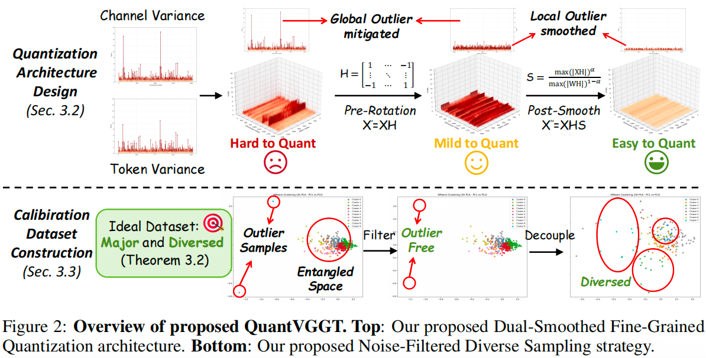
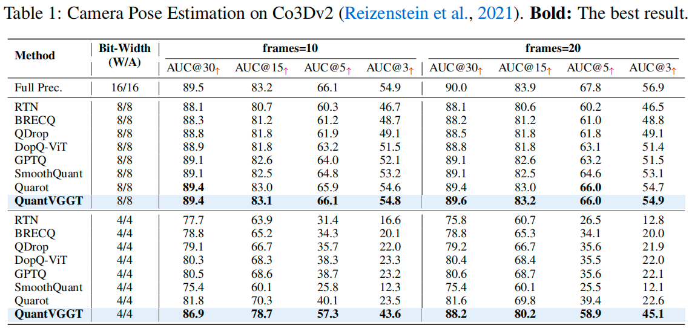

# Quantized Visual Geometry Grounded Transformer

[arXiv](https://arxiv.org/abs/2509.21302) | [BibTeX](#bibtex)

------

This project is the official implementation of our QuantVGGT: "Quantized Visual Geometry Grounded Transformer".





------

## Results



## Comments

- Our code will be released soon!

## BibTeX

If you find *QuantVGGT* is useful and helpful to your work, please kindly cite this paper:

```
@article{feng2025quantized,
  title={Quantized Visual Geometry Grounded Transformer},
  author={Feng, Weilun and Qin, Haotong and Wu, Mingqiang and Yang, Chuanguang and Li, Yuqi and Li, Xiangqi and An, Zhulin and Huang, Libo and Zhang, Yulun and Magno, Michele and others},
  journal={arXiv preprint arXiv:2509.21302},
  year={2025}
}
```

